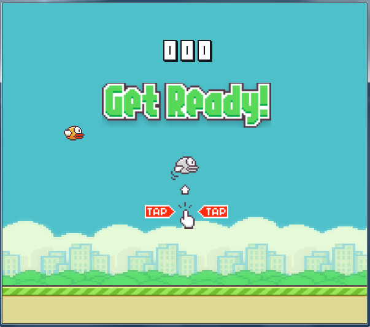

# FlappyBird

Remake of well-known mobile game FlappyBird on Java. The game is a side-scroller where the player controls a bird, attempting to fly between rows of green pipes without hitting them.

## Controls:

Player controls the bird by clicking the mouse on the game's window, that force bird to fly up.

## Technologies used:

This project tries to take a modern approach to Java software development, producing a self-contained application which embeds everything needed to run on any JVM in a development, CI or production environment. 

- Java 8 with JavaFX 8 and lambdas support
- [Apache Maven](https://maven.apache.org/) for build automation and dependency resolution
- IDE used in project is [IntelliJ IDEA 15](https://www.jetbrains.com/idea/)

## Installation:

To get the project you can simply use this HTTPS-link:  
https://github.com/quar17esma/FlappyBird.git  
Main class is src/main/java/Game.java  
JAR file is included  

## Disclaimer:

This project is intended for non-commercial educational purposes.
